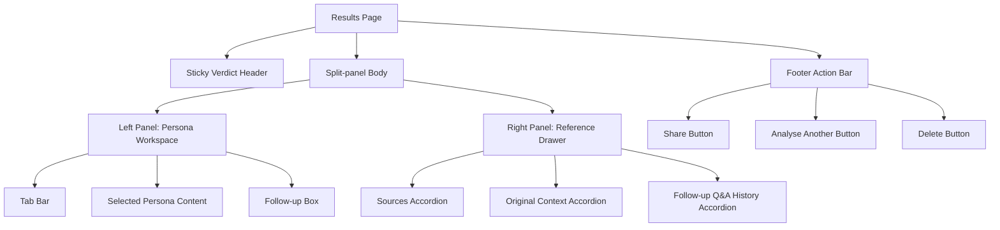

# 2025 Layout Implementation Plan

## Current Application Overview

The "Am I Being Unreasonable?" application allows users to:
1. Enter a situation and select a query (e.g., "Am I being unreasonable?")
2. Optionally answer follow-up questions
3. Receive an analysis with perspectives from three personas: Therapist, Analyst, and Coach
4. View results with a verdict, detailed analysis, and the ability to ask follow-up questions
5. Share results or start a new analysis

## Requested Layout Changes

### 1. Sticky Verdict Header
- Fixed at top while scrolling
- Shows: "You asked" paraphrase, verdict badge, 1-line rationale
- Always visible for instant context and status

### 2. Split-panel Body (Desktop ≥ 1024px)
- **Left 60%: Persona Workspace**
  - Tab bar for Therapist/Analyst/Coach
  - Each tab shows 3-bullet key points and 80-word rationale with inline citations
  - Follow-up box stays inside current persona

- **Right 40%: Reference/Context Drawer**
  - Accordion sections for sources, original context, and follow-up Q&A history
  - Sources clickable to scroll to snippets
  - External links open in new tab
  - Drawer can be hidden on small screens

### 3. Footer Action Bar
- "Share" button creates public link
- "Analyse another" returns to home
- "Delete" removes result from cache

### 4. Micro-interactions
- Hover on citations highlights matching snippet
- Drawer search field for snippets
- Progress toast for generating follow-up answers
- Animations < 200ms with reduced-motion support

### 5. Accessibility & Theming
- Color-blind-safe verdict badges
- Full keyboard navigation
- Light/dark theme toggle with localStorage persistence

## Implementation Plan

### Phase 1: Component Structure and Layout Framework

1. **Create New Layout Components**
   - `components/results/StickyVerdictHeader.js`
   - `components/results/PersonaWorkspace.js`
   - `components/results/ReferenceDrawer.js`
   - `components/results/FooterActionBar.js`

2. **Update Results Page Structure**
   - Modify `app/results/[id]/page.js` to implement the new layout structure
   - Add responsive layout with CSS Grid/Flexbox for split-panel design
   - Implement media queries for desktop (≥1024px) and mobile layouts

### Phase 2: Sticky Verdict Header Implementation

1. **Extract Verdict Information**
   - Use existing `extractVerdictParts` function to get verdict information
   - Create a condensed version of the verdict for the header

2. **Implement Sticky Behavior**
   - Use CSS `position: sticky` with appropriate z-index
   - Add scroll event listener for enhanced behavior if needed
   - Ensure smooth transition when scrolling

### Phase 3: Persona Workspace Implementation

1. **Create Tab Interface**
   - Implement accessible tab system using `role="tablist"` and related ARIA attributes
   - Style tabs to match design requirements

2. **Persona Content Display**
   - Format key points as bullet list
   - Implement 80-word rationale with citation support
   - Create citation system that links to reference drawer

3. **Follow-up Box Integration**
   - Move follow-up functionality into each persona tab
   - Ensure follow-up questions stay contextual to the current persona

### Phase 4: Reference Drawer Implementation

1. **Create Accordion Structure**
   - Implement using HTML `<details>` and `<summary>` elements for accessibility
   - Style to match design requirements

2. **Source Citation System**
   - Implement click-to-scroll functionality for source citations
   - Add external link handling to open in new tabs

3. **Responsive Behavior**
   - Implement drawer that can be hidden on small screens
   - Create bottom sheet toggle for mobile view

### Phase 5: Footer Action Bar Implementation

1. **Create Fixed Footer**
   - Implement sticky footer with action buttons
   - Style to match design requirements

2. **Implement Actions**
   - Connect "Share" button to existing sharing functionality
   - Link "Analyse another" to home page with pre-filled text
   - Implement "Delete" functionality to remove result from cache

### Phase 6: Micro-interactions and Accessibility

1. **Citation Hover Highlighting**
   - Implement hover effect that highlights matching snippet in drawer
   - Add visual feedback for the interaction

2. **Snippet Search**
   - Add search field for snippets when list exceeds 5 items
   - Implement filtering functionality

3. **Progress Toast**
   - Create toast component for follow-up answer generation
   - Implement animation and dismissal behavior

4. **Accessibility Improvements**
   - Ensure color-blind-safe verdict badges
   - Implement full keyboard navigation
   - Add appropriate ARIA attributes
   - Test with screen readers

5. **Theming Support**
   - Implement CSS variables for theming
   - Add light/dark mode toggle
   - Use localStorage to remember user preference

## Technical Implementation Details

### Sticky Verdict Header

```jsx
// components/results/StickyVerdictHeader.js
import React from 'react';
import { extractVerdictParts } from '@/lib/analysisUtils';

export default function StickyVerdictHeader({ query, summary }) {
  const verdictParts = summary ? extractVerdictParts(summary) : null;
  
  return (
    <header className="sticky top-0 z-50 bg-background/95 backdrop-blur-sm border-b border-border/40 p-3 shadow-sm">
      <div className="max-w-5xl mx-auto flex items-center justify-between">
        <div className="flex-1">
          <p className="text-sm text-secondary-foreground">You asked: {query}</p>
        </div>
        {verdictParts && (
          <>
            <div className="flex-shrink-0 mx-4">
              <span className="px-3 py-1 rounded-full bg-primary text-white font-medium text-sm">
                {/* Extract verdict (Yes/No/Partially) from first sentence */}
                {verdictParts.firstSentence.includes('Yes') ? 'Yes' : 
                 verdictParts.firstSentence.includes('No') ? 'No' : 'Partially'}
              </span>
            </div>
            <div className="flex-1 truncate">
              <p className="text-sm font-medium">{verdictParts.firstSentence}</p>
            </div>
          </>
        )}
      </div>
    </header>
  );
}
```

### Split-panel Layout

```jsx
// Partial update to app/results/[id]/page.js
<main className="min-h-screen bg-gradient-to-br from-background to-secondary/10">
  {/* Sticky Verdict Header */}
  <StickyVerdictHeader query={resultsData?.query} summary={resultsData?.summary} />
  
  {/* Split-panel Body */}
  <div className="grid grid-cols-1 lg:grid-cols-5 gap-6 p-4 max-w-7xl mx-auto">
    {/* Left Panel: Persona Workspace (60%) */}
    <div className="lg:col-span-3">
      <PersonaWorkspace 
        responses={processedResponses} 
        selectedPersona={selectedPersona}
        handleSelectPersona={handleSelectPersona}
        followUpChat={/* follow-up chat props */}
      />
    </div>
    
    {/* Right Panel: Reference Drawer (40%) */}
    <div className="lg:col-span-2">
      <ReferenceDrawer 
        context={resultsData?.context}
        snippets={resultsData?.snippets}
        followUpResponses={resultsData?.followUpResponses}
      />
    </div>
  </div>
  
  {/* Footer Action Bar */}
  <FooterActionBar 
    handleShareClick={handleShareClick} 
    shareStatus={shareStatus}
  />
</main>
```

### Persona Workspace with Tabs

```jsx
// components/results/PersonaWorkspace.js
import React, { useState } from 'react';

export default function PersonaWorkspace({ responses, selectedPersona, handleSelectPersona, followUpChat }) {
  const selectedResponse = responses.find(r => r.name === selectedPersona);
  
  return (
    <div className="bg-secondary/40 backdrop-blur-lg shadow-xl rounded-xl p-6 border border-white/10">
      {/* Tab Bar */}
      <div role="tablist" className="flex border-b border-border/40 mb-6">
        {responses.map(response => (
          <button
            key={response.name}
            role="tab"
            aria-selected={selectedPersona === response.name}
            aria-controls={`panel-${response.name}`}
            id={`tab-${response.name}`}
            onClick={() => handleSelectPersona(response.name)}
            className={`px-4 py-2 font-medium ${
              selectedPersona === response.name 
                ? 'text-primary border-b-2 border-primary' 
                : 'text-secondary-foreground hover:text-foreground'
            }`}
          >
            {response.shortName || response.name}
          </button>
        ))}
      </div>
      
      {/* Tab Content */}
      {selectedResponse && (
        <div
          role="tabpanel"
          id={`panel-${selectedResponse.name}`}
          aria-labelledby={`tab-${selectedResponse.name}`}
          className="space-y-6"
        >
          {/* Key Points */}
          {selectedResponse.key_points && (
            <ul className="list-disc list-inside space-y-2 pl-2">
              {selectedResponse.key_points.map((point, index) => (
                <li key={index} className="text-foreground">{point}</li>
              ))}
            </ul>
          )}
          
          {/* Rationale with Citations */}
          <div className="prose prose-sm text-foreground">
            {/* Implement citation system here */}
            {selectedResponse.rationale}
          </div>
          
          {/* Follow-up Box */}
          <div className="mt-6 pt-4 border-t border-border/40">
            {/* Follow-up chat component specific to this persona */}
            {/* ... */}
          </div>
        </div>
      )}
    </div>
  );
}
```

### Reference Drawer with Accordions

```jsx
// components/results/ReferenceDrawer.js
import React, { useState } from 'react';

export default function ReferenceDrawer({ context, snippets, followUpResponses }) {
  const [searchTerm, setSearchTerm] = useState('');
  
  // Filter snippets based on search term
  const filteredSnippets = snippets?.filter(snippet => 
    snippet.text.toLowerCase().includes(searchTerm.toLowerCase())
  ) || [];
  
  return (
    <div className="bg-secondary/40 backdrop-blur-lg shadow-xl rounded-xl border border-white/10 overflow-hidden">
      {/* Search field (only if snippets > 5) */}
      {snippets && snippets.length > 5 && (
        <div className="p-4 border-b border-border/40">
          <input
            type="search"
            placeholder="Search snippets..."
            value={searchTerm}
            onChange={(e) => setSearchTerm(e.target.value)}
            className="w-full px-3 py-2 bg-background/50 border border-border/40 rounded-md"
          />
        </div>
      )}
      
      {/* Sources Accordion */}
      <details className="group">
        <summary className="flex justify-between items-center p-4 cursor-pointer border-b border-border/40">
          <h3 className="font-medium">Sources</h3>
          <span className="transform group-open:rotate-180 transition-transform duration-150">▼</span>
        </summary>
        <div className="p-4 space-y-3 max-h-80 overflow-y-auto">
          {filteredSnippets.map((snippet, index) => (
            <div key={index} id={`snippet-${index}`} className="p-2 border border-border/40 rounded-md">
              <p className="text-sm">{snippet.text}</p>
              {snippet.url && (
                <a 
                  href={snippet.url} 
                  target="_blank" 
                  rel="noopener noreferrer"
                  className="text-xs text-primary hover:underline mt-1 inline-block"
                >
                  Source Link
                </a>
              )}
            </div>
          ))}
        </div>
      </details>
      
      {/* Original Context Accordion */}
      <details>
        <summary className="flex justify-between items-center p-4 cursor-pointer border-b border-border/40">
          <h3 className="font-medium">Original Context</h3>
          <span className="transform group-open:rotate-180 transition-transform duration-150">▼</span>
        </summary>
        <div className="p-4">
          <p className="text-sm whitespace-pre-wrap">{context}</p>
        </div>
      </details>
      
      {/* Follow-up Q&A History Accordion */}
      <details>
        <summary className="flex justify-between items-center p-4 cursor-pointer border-b border-border/40">
          <h3 className="font-medium">Follow-up Q&A History</h3>
          <span className="transform group-open:rotate-180 transition-transform duration-150">▼</span>
        </summary>
        <div className="p-4 space-y-3">
          {followUpResponses?.map((item, index) => (
            <div key={index} className="border-b border-border/40 pb-2 last:border-0">
              <p className="font-medium text-sm">Q: {item.question}</p>
              <p className="text-sm mt-1">A: {item.answer}</p>
            </div>
          ))}
        </div>
      </details>
    </div>
  );
}
```

### Footer Action Bar

```jsx
// components/results/FooterActionBar.js
import React from 'react';
import Link from 'next/link';
import { ShareIcon, ArrowPathIcon, TrashIcon } from '@heroicons/react/24/outline';

export default function FooterActionBar({ handleShareClick, shareStatus, handleDelete }) {
  return (
    <footer className="fixed bottom-0 left-0 right-0 bg-background/95 backdrop-blur-sm border-t border-border/40 p-3 shadow-lg z-40">
      <div className="max-w-5xl mx-auto flex justify-between items-center">
        <button
          onClick={handleShareClick}
          className="inline-flex items-center px-4 py-2 text-sm font-medium text-white bg-primary rounded-md hover:bg-primary-hover"
        >
          <ShareIcon className="w-4 h-4 mr-2" />
          {shareStatus || 'Share'}
        </button>
        
        <Link href="/" className="inline-flex items-center px-4 py-2 text-sm font-medium text-foreground bg-secondary/50 rounded-md hover:bg-secondary">
          <ArrowPathIcon className="w-4 h-4 mr-2" />
          Analyse Another
        </Link>
        
        <button
          onClick={handleDelete}
          className="inline-flex items-center px-4 py-2 text-sm font-medium text-red-500 bg-transparent rounded-md hover:bg-red-500/10"
        >
          <TrashIcon className="w-4 h-4" />
          <span className="sr-only">Delete</span>
        </button>
      </div>
    </footer>
  );
}
```

## Mobile Adaptations

For mobile devices (≤1024px):
1. Persona tabs become swipeable cards
2. Reference drawer becomes a bottom sheet that can be toggled

```jsx
// Mobile adaptation for PersonaWorkspace
const isMobile = useMediaQuery('(max-width: 1024px)');

return (
  <div>
    {isMobile ? (
      <SwipeableCards responses={responses} selectedPersona={selectedPersona} />
    ) : (
      <TabInterface responses={responses} selectedPersona={selectedPersona} />
    )}
  </div>
);

// Mobile adaptation for ReferenceDrawer
return (
  <>
    {isMobile ? (
      <>
        <button 
          onClick={() => setIsDrawerOpen(!isDrawerOpen)}
          className="fixed bottom-16 right-4 z-30 p-2 bg-primary text-white rounded-full shadow-lg"
        >
          <InfoIcon className="w-6 h-6" />
        </button>
        <BottomSheet isOpen={isDrawerOpen} onClose={() => setIsDrawerOpen(false)}>
          <ReferenceDrawerContent {...props} />
        </BottomSheet>
      </>
    ) : (
      <ReferenceDrawerContent {...props} />
    )}
  </>
);
```

## Accessibility & Theming Implementation

```jsx
// Theme toggle component
function ThemeToggle() {
  const [theme, setTheme] = useState(() => {
    if (typeof window !== 'undefined') {
      return localStorage.getItem('theme') || 'light';
    }
    return 'light';
  });
  
  useEffect(() => {
    if (theme === 'dark') {
      document.documentElement.classList.add('dark');
    } else {
      document.documentElement.classList.remove('dark');
    }
    localStorage.setItem('theme', theme);
  }, [theme]);
  
  return (
    <button 
      onClick={() => setTheme(theme === 'light' ? 'dark' : 'light')}
      className="p-2 rounded-md bg-secondary/50 text-foreground"
      aria-label={`Switch to ${theme === 'light' ? 'dark' : 'light'} mode`}
    >
      {theme === 'light' ? <MoonIcon className="w-5 h-5" /> : <SunIcon className="w-5 h-5" />}
    </button>
  );
}

// Color-blind safe verdict badges
const verdictColors = {
  'Yes': {
    bg: 'bg-emerald-600', // Green that works for most color vision deficiencies
    text: 'text-white'
  },
  'No': {
    bg: 'bg-blue-600', // Blue instead of red for deuteranopia/protanopia
    text: 'text-white'
  },
  'Partially': {
    bg: 'bg-amber-500', // Amber that's distinguishable from both green and blue
    text: 'text-black'
  }
};
```

## Implementation Timeline

1. **Week 1: Setup and Structure**
   - Create new component files
   - Implement basic layout structure
   - Set up responsive grid system

2. **Week 2: Core Features**
   - Implement sticky header
   - Build tab system for personas
   - Create accordion system for reference drawer

3. **Week 3: Mobile Adaptations**
   - Implement swipeable cards for mobile
   - Create bottom sheet for reference drawer
   - Test and refine responsive behavior

4. **Week 4: Micro-interactions and Polish**
   - Implement citation hover highlighting
   - Add snippet search functionality
   - Create progress toast for follow-up generation
   - Implement animations with reduced-motion support

5. **Week 5: Accessibility and Testing**
   - Implement keyboard navigation
   - Add ARIA attributes
   - Create color-blind safe verdict badges
   - Implement theme toggle with localStorage
   - Test with screen readers and keyboard-only navigation

## Benefits of the New Layout

1. **Improved User Experience**
   - Verdict always in view → zero cognitive load
   - Personas and follow-ups live together; no context switch
   - References visible but unobtrusive
   - Sticky action bar keeps primary actions reachable

2. **Better Accessibility**
   - Color-blind-safe design
   - Full keyboard navigation
   - Proper semantic HTML structure
   - Reduced motion support

3. **Enhanced Mobile Experience**
   - Swipeable cards for personas
   - Bottom sheet for reference drawer
   - Optimized for touch interaction

4. **Performance Improvements**
   - Lazy-loaded components
   - Optimized animations
   - Efficient DOM updates

## Diagram: Layout Structure



## Diagram: Component Hierarchy

```mermaid
graph TD
    A[app/results/[id]/page.js] --> B[StickyVerdictHeader]
    A --> C[PersonaWorkspace]
    A --> D[ReferenceDrawer]
    A --> E[FooterActionBar]
    
    C --> F[TabInterface/SwipeableCards]
    C --> G[FollowUpChat]
    
    D --> H[SearchField]
    D --> I[AccordionSection]
    
    I --> J[SourcesList]
    I --> K[ContextDisplay]
    I --> L[FollowUpHistory]
```

This implementation plan provides a comprehensive roadmap for developing the 2025 layout, with a focus on improved user experience, accessibility, and responsive design.