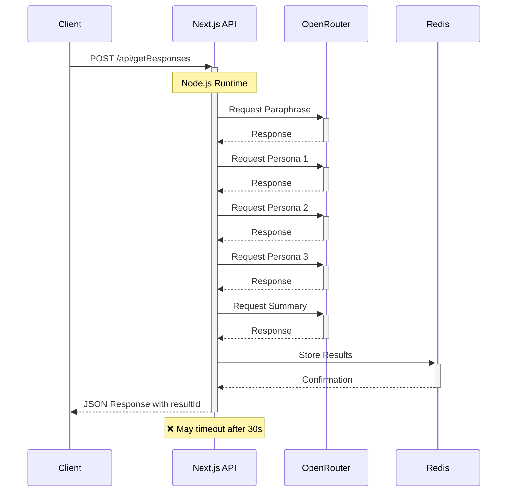
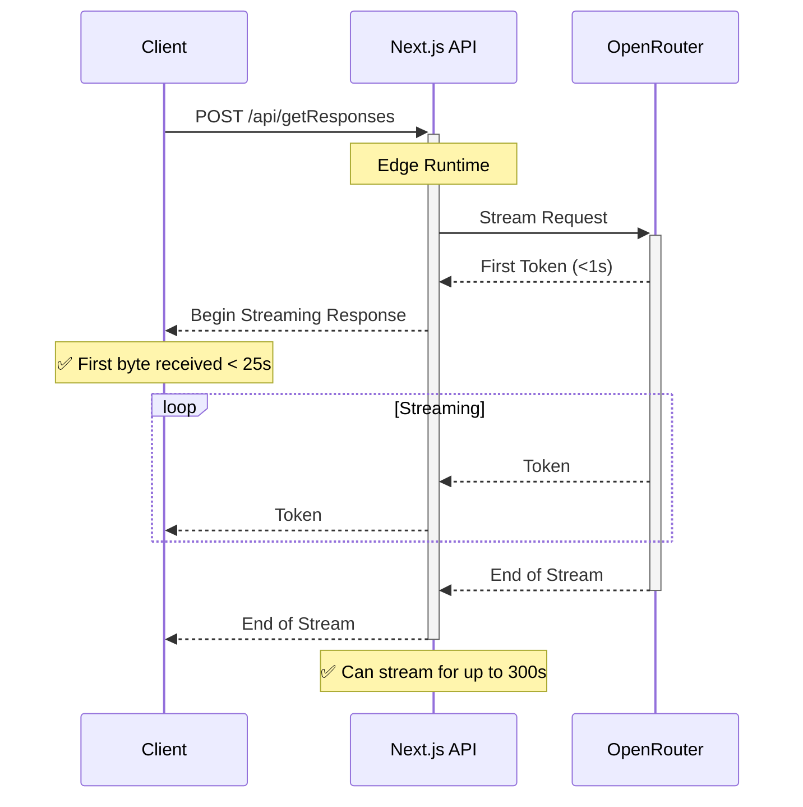

# Edge Function Architecture

## Current Architecture (Node.js Serverless Function)

## New Architecture (Edge Function with Streaming)

## Benefits of Edge Functions

1. **Faster Initial Response**: Edge Functions deliver the first byte in under 1 second
2. **Extended Runtime**: Can stream for up to 300 seconds on any plan (including Hobby)
3. **Global Distribution**: Run closer to users at the edge of the network
4. **No Timeouts**: Bypass the Node.js 30/60 second limits on the Hobby plan

## Implementation Differences

| Feature | Node.js Serverless | Edge Function |
|---------|-------------------|---------------|
| Runtime | Node.js | Edge |
| Response Type | JSON | Streaming |
| Max Duration | 30s (Hobby) / 60s (Pro) | 300s (All plans) |
| First Byte | After completion | <1s |
| API Calls | Multiple sequential | Single streaming |
| Redis Storage | Yes | Not in initial implementation |
| Complex Logic | Multiple personas | Simplified for streaming |