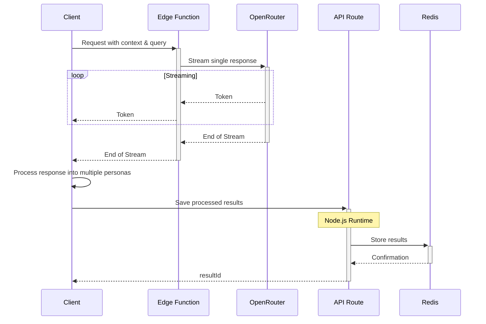
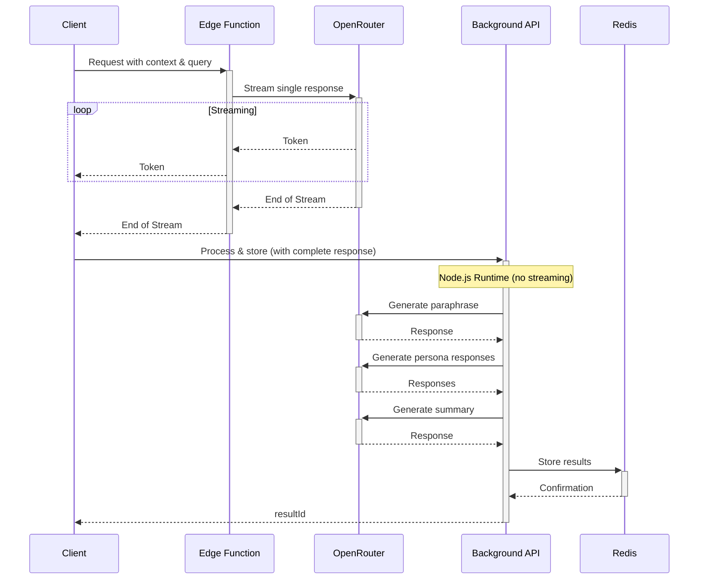
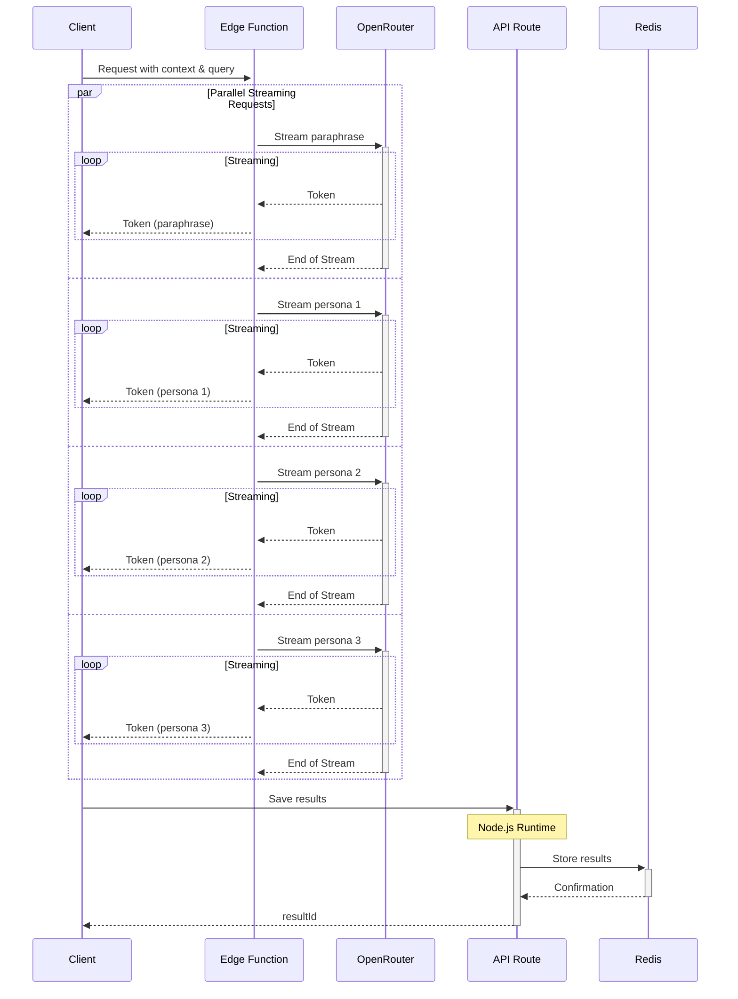
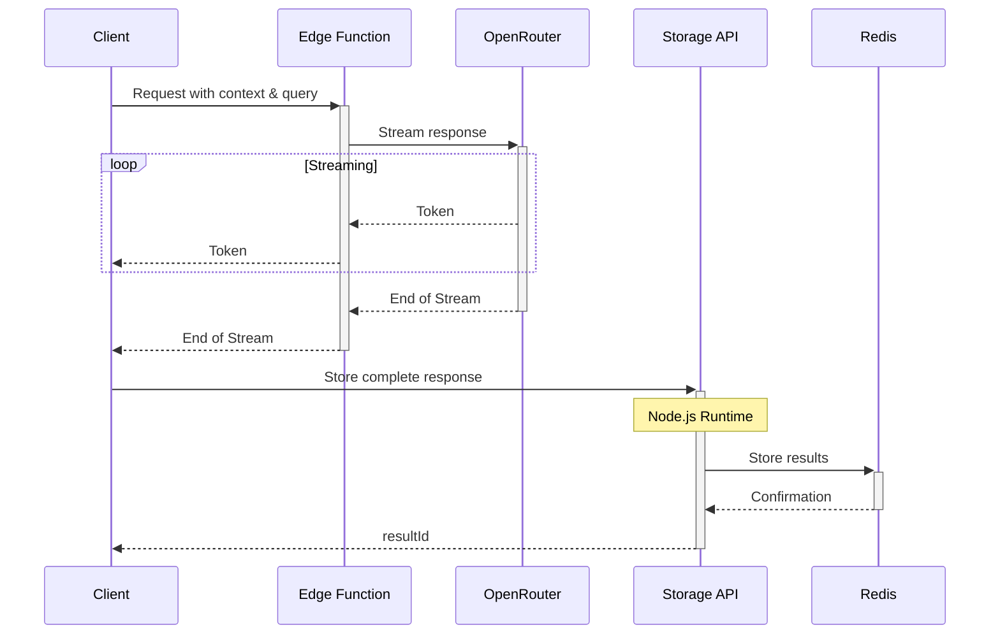

# Future Enhancements for Edge Function

Once the basic streaming implementation is confirmed working, we can consider the following enhancements to reintegrate the multi-persona logic and Redis storage.

## Reintegrating Multi-Persona Logic

### Option 1: Client-Side Processing



**Pros:**
- Edge Function remains simple and focused on streaming
- No timeout issues for the streaming part
- Client can process the response as it arrives

**Cons:**
- Increases client-side complexity and processing
- May not be suitable for low-powered devices
- Requires JavaScript implementation of processing logic

### Option 2: Hybrid Approach with Background Processing



**Pros:**
- User gets immediate streaming response
- Full multi-persona processing still happens
- No timeout issues for the streaming part

**Cons:**
- More complex architecture
- Background processing could still timeout
- Requires coordination between streaming and background processes

### Option 3: Multiple Streaming Requests



**Pros:**
- Maintains multi-persona logic
- All responses stream in parallel
- User sees all perspectives simultaneously

**Cons:**
- More complex Edge Function implementation
- Higher cost (multiple API calls)
- More complex client-side handling

## Redis Storage with Edge Functions

### Challenge

Edge Functions have limited compatibility with some Node.js APIs, including certain database clients. The current Redis implementation using `@upstash/redis` may not work directly in an Edge Function.

### Solutions

1. **Use Vercel KV (Recommended)**

```typescript
import { kv } from '@vercel/kv';

// In Edge Function
const resultId = crypto.randomUUID().substring(0, 10);
await kv.hset(`result:${resultId}`, {
  // data to store
});
```

2. **Use Redis REST API**

```typescript
// In Edge Function
const resultId = crypto.randomUUID().substring(0, 10);
const key = `result:${resultId}`;

await fetch(`${process.env.UPSTASH_REDIS_REST_URL}/hset/${key}`, {
  method: 'POST',
  headers: {
    Authorization: `Bearer ${process.env.UPSTASH_REDIS_REST_TOKEN}`,
    'Content-Type': 'application/json'
  },
  body: JSON.stringify({
    // data to store
  })
});
```

3. **Separate Storage Endpoint**



## Recommended Approach

1. **Phase 1: Basic Streaming Implementation**
   - Implement the simple Edge Function as outlined in the implementation plan
   - Verify it works without timeouts

2. **Phase 2: Add Storage**
   - Integrate Vercel KV for Redis storage in the Edge Function
   - Store the complete streamed response

3. **Phase 3: Reintegrate Multi-Persona Logic**
   - Implement Option 2 (Hybrid Approach) or Option 3 (Multiple Streaming)
   - Test thoroughly to ensure no timeouts occur

4. **Phase 4: Optimize and Enhance**
   - Add error handling and retry logic
   - Implement caching for improved performance
   - Add monitoring and logging