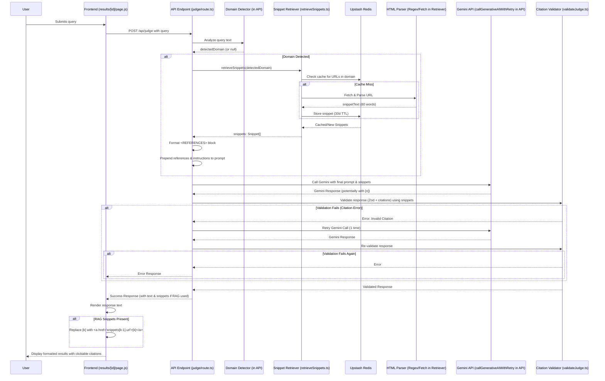

# RAG Implementation Plan

## Overview

This plan outlines the steps to implement a Retrieval-Augmented Generation (RAG) layer for the application. The RAG layer will fetch relevant 80-word snippets from a fixed whitelist of UK statutory/charity URLs based on domain detection (keyword matching), cache these snippets in Upstash Redis, and inject them into the Gemini prompt. The AI will be instructed to cite these sources using `[n]` notation, which the backend will validate and the frontend will render as clickable links.

## Phases

1.  **Foundational Setup & Configuration:** Prepare dependencies and Redis connection.
2.  **Core RAG Logic:** Implement domain detection, snippet retrieval, prompt integration, and citation validation.
3.  **Supporting Components & Infrastructure:** Add seeder script, CI action, update frontend, tests, fix icons, and update docs.

## Detailed Steps

1.  **Dependencies:**
    *   Add `ts-node` to `devDependencies` in `package.json`.
    *   Create `lib/approvedSources.ts` exporting `WHITELISTED_SOURCES: { domain: string, url: string }[]`. Populate this with the actual approved URLs and their corresponding domains (e.g., 'parenting', 'tenancy').

2.  **Redis Client:**
    *   Ensure the `@upstash/redis` client instance correctly reads `process.env.STORAGE_KV_REST_API_URL` and `process.env.STORAGE_KV_REST_API_TOKEN`.

3.  **Domain Keywords (`lib/domainKeywords.ts`):**
    *   Create `lib/domainKeywords.ts`.
    *   Define and export `domainKeywords`: an object mapping domains (parenting, tenancy, etc.) to arrays of keywords.

4.  **Domain Detection (`app/api/judge/route.ts`):**
    *   Import `domainKeywords`.
    *   Remove existing inline keyword definitions.
    *   Implement detection logic: Count keyword hits in user input; if ≥ 2 hits for a domain, assign that domain, else skip RAG.

5.  **Snippet Retrieval (`lib/retrieveSnippets.ts`):**
    *   Import `WHITELISTED_SOURCES` from `lib/approvedSources.ts`.
    *   Import and use the configured Redis client.
    *   Modify `retrieveSnippets(domain)`:
        *   Filter `WHITELISTED_SOURCES` for the detected `domain`.
        *   For each relevant URL: Check Redis cache (key=URL).
        *   On cache miss: Use global `fetch`, use Regex to extract first `
` text, strip tags, truncate to 80 words, store `{ url, text }` in Redis (30-day TTL: `EX: 2592000`).
        *   On cache hit: Parse stored JSON.
        *   Add logging: `console.log(\`[RAG] domain=${domain} urls=${urls.length} hits=${snippets.length}\`);`
        *   Return `Promise<Snippet[]>`, where `Snippet = { url: string; text: string }`.

6.  **Prompt Integration (`app/api/judge/route.ts`):**
    *   Before calling `callGenerativeAIWithRetry`:
        *   Call domain detector.
        *   If domain detected: Call `retrieveSnippets`.
        *   If `snippets.length > 0`:
            *   Format `<REFERENCES>` block: `[n] (URLn) Snippetn text...`
            *   Prepend block and citation instruction (`- When you cite... DO NOT reveal the URL...`) to the prompt.
            *   Pass `snippets` array to `callGenerativeAIWithRetry`.

7.  **Citation Validation (`lib/validateJudge.ts` & `app/api/judge/route.ts`):**
    *   Modify validation in `lib/validateJudge.ts` to receive `snippets`.
    *   Extract all `[n]` from Gemini response.
    *   Check `1 <= n <= snippets.length`. If invalid, throw `Error('Invalid citation number')`.
    *   Ensure `callGenerativeAIWithRetry` catches this error and retries once, passing `snippets` to the validation step.

8.  **Seeder Script (`scripts/seedSnippets.ts`):**
    *   Create `scripts/seedSnippets.ts`.
    *   Import `WHITELISTED_SOURCES` and Redis client.
    *   Iterate *all* URLs in `WHITELISTED_SOURCES`.
    *   Use the *exact same* fetch/parse/truncate/store logic as `retrieveSnippets` (consider extracting shared logic).

9.  **GitHub Action (`.github/workflows/seed-snippets.yml`):**
    *   Create file with `on: workflow_dispatch: {}`.
    *   Setup Node.js, `pnpm install`.
    *   Run seeder: `pnpm run seed:snippets`.
    *   Ensure Redis env vars (`STORAGE_KV_REST_API_URL`, `STORAGE_KV_REST_API_TOKEN`) are available as secrets.

10. **Frontend Rendering (`app/results/[id]/page.js`):**
    *   Receive `snippets` array from API response.
    *   If `snippets` present: Use Regex (`/\[(\d+)\]/g`) to find `[k]`. If `1 <= k <= snippets.length`, replace with `<a href={snippets[k-1].url} target="_blank" rel="noopener noreferrer">[k]</a>`.

11. **Testing (`tests/judge.test.ts` & `tests/golden/`):**
    *   Update mocks/fixtures to include `snippets: { url, text }[]` when RAG is active.
    *   Add/update tests with `"expectCitation": true` for RAG scenarios, asserting `[n]` presence.
    *   Ensure `unrelated_scenario.json` (`"expectCitation": false`) verifies no references/citations.

12. **Icon Exports (`components/ui/Icons.js`):**
    *   Add `export` before `ShareIcon` and `ArrowPathIcon` declarations.

13. **`package.json` Script:**
    *   Add `"seed:snippets": "ts-node scripts/seedSnippets.ts"` to `"scripts"`.

14. **Documentation (`README.md`):**
    *   Add note: Run `pnpm run seed:snippets` (manually via GH Action or locally) after deploy to warm cache.

## Sequence Diagram

## Environment Variables Required

*   `STORAGE_KV_REST_API_URL`: URL for the Upstash Redis instance.
*   `STORAGE_KV_REST_API_TOKEN`: Token for the Upstash Redis instance.
*   `GEMINI_API_KEY`: Primary Gemini API Key.
*   `GEMINI_BACKUP_KEY`: Backup Gemini API Key.

## Notes

*   The `lib/approvedSources.ts` file needs to be populated with the actual list of `{ domain: string, url: string }` objects.
*   Shared logic between `retrieveSnippets.ts` and `seedSnippets.ts` should ideally be extracted into a common utility function.