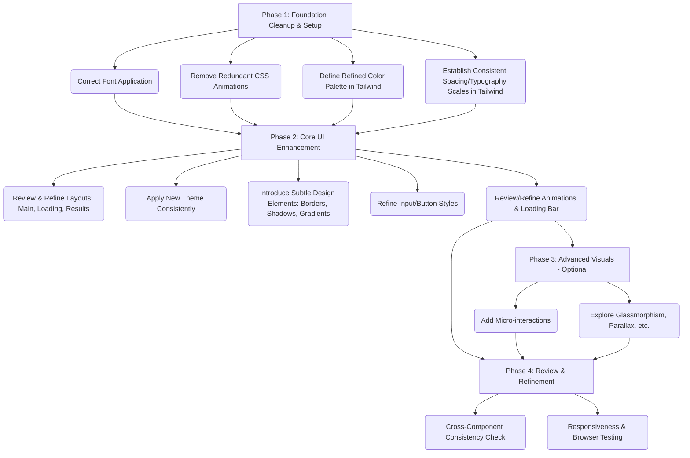

# Visual Design Enhancement Plan

## Summary of Findings

1.  **Fonts:** `Geist` fonts are configured but overridden by basic `Arial/Helvetica` in `globals.css`.
2.  **Animations:** Defined correctly in `tailwind.config.js` but duplicated unnecessarily in `globals.css`.
3.  **Color Theme:** No specific theme defined beyond basic dark/light mode backgrounds/foregrounds. User preference for dark with blue needs formal definition.
4.  **Consistency:** Requires using shared design tokens (colors, fonts, spacing) and potentially reusable components.

## Proposed Plan

## Phase Details

*   **Phase 1: Foundation Cleanup & Setup**
    *   Correct Font Application: Modify `app/globals.css` to use the `--font-geist-sans` variable for the body font.
    *   Remove Redundant CSS Animations: Delete the `@keyframes` and corresponding animation class definitions from `app/globals.css` that duplicate those in `tailwind.config.js`.
    *   Define Refined Color Palette: Extend `theme.extend.colors` in `tailwind.config.js` with specific shades for background, foreground, primary (blue), accents, borders, etc., supporting the dark theme.
    *   Establish Consistent Spacing/Typography Scales: Review and potentially customize Tailwind's default spacing and font size scales in `tailwind.config.js` if needed for the desired aesthetic.

*   **Phase 2: Core UI Enhancement**
    *   Review & Refine Layouts: Examine `app/page.js`, `components/ui/LoadingScreen.js`, and the results components (e.g., `app/results/[id]/page.js`, `components/home/ResultsSection.js`). Apply consistent padding, margins, and structure using the defined scales.
    *   Apply New Theme Consistently: Replace existing color classes/styles with the newly defined theme colors from `tailwind.config.js`.
    *   Introduce Subtle Design Elements: Add subtle visual flair using Tailwind utilities or custom CSS where necessary (e.g., soft shadows, refined borders, subtle background gradients/textures).
    *   Refine Input/Button Styles: Update the appearance of form inputs, dropdowns, and buttons to match the new theme and aesthetic.
    *   Review/Refine Animations & Loading Bar: Ensure existing animations are smooth and serve a purpose. Verify the loading bar animation (`pulse-bar` or similar) remains visually effective within the new design.

*   **Phase 3: Advanced Visuals (Optional)**
    *   Explore more complex effects like glassmorphism, advanced gradients, or subtle parallax if they align with the "stunning" goal and don't compromise usability.
    *   Add micro-interactions (e.g., subtle hover effects, input focus animations) for better feedback.

*   **Phase 4: Review & Refinement**
    *   Thoroughly check consistency across all affected pages and components.
    *   Test responsiveness on different screen sizes and ensure compatibility across major browsers.